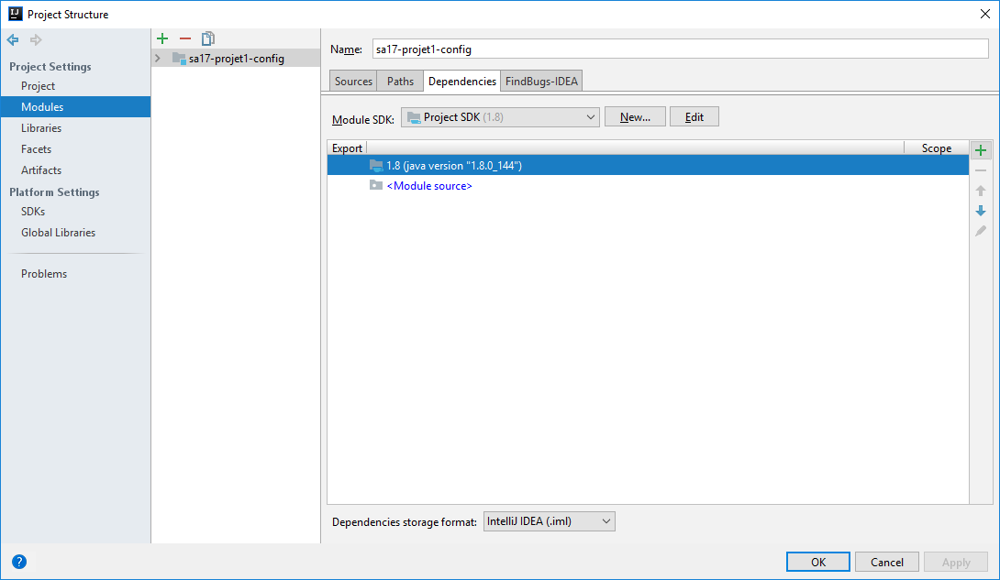
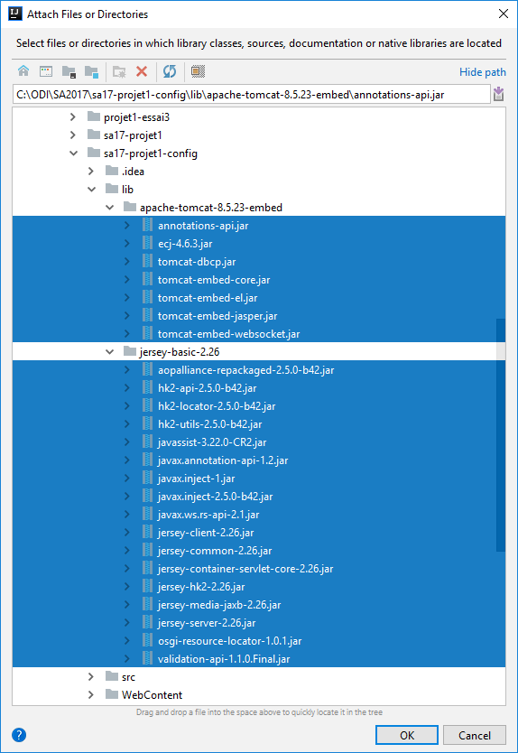
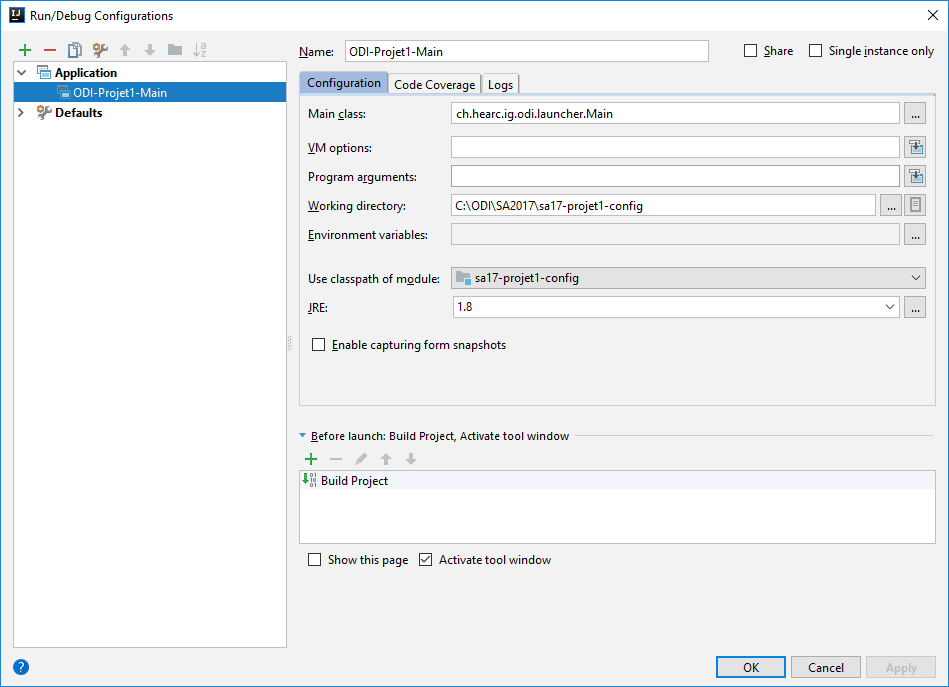

# Importation du projet
Pour éviter les problèmes de configuration et les problèmes liés au serveur d’application, nous avons choisi d’utiliser un serveur Tomcat embarqué pour ce projet. L’ensemble des dépendances nécessaires au fonctionnement de Tomcat et Jersey est inclus dans le dossier lib.
## Clonez
Clonez ce répository sur votre machine.
## Importation du projet dans Intellij
New > Project from existing sources…

Fenêtre « Import Project » choisir « Create project from existing sources »

Intellij devrait vous proposer d’utiliser le dossier « src » comme base pour les sources du projet. Acceptez.

Faites suivant jusqu’à la fin, vous ajouterez les librairies une fois le projet ouvert.
## Ajout des dépendances
Ouvrez le menu « Project Structure » (Ctrl + Shift + Alt + S)

Dans la section Modules, allez dans l’onglet « Dependencies »
 
Ajoutez (bouton +) tous les jars présents dans le dossier lib

## Configuration d’exécution

## Test
Lancez l’exécution. 

Une requête GET sur http://localhost:8888/tomcatembedded/rest/helloworld doit vous renvoyer le hashcode de la classe service.

